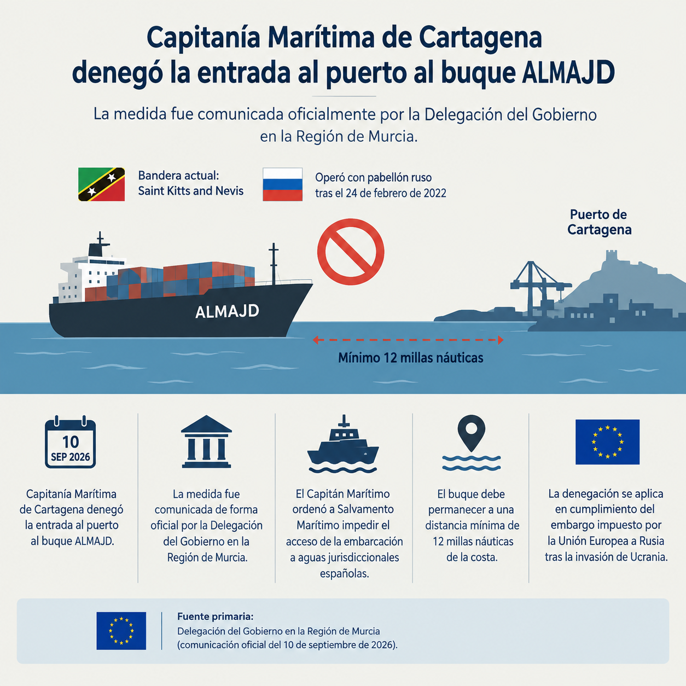

# MALDITOESPEJO — Cartagena

**Fecha de publicación:** 11 de septiembre de 2026  
**Sección:** Cartagena  
**Autor:** Redacción MALDITOESPEJO

---

## Capitanía Marítima deniega la entrada al buque ALMAJD en el puerto de Cartagena

Capitanía Marítima de Cartagena denegó el 10 de septiembre de 2026 la entrada al puerto de Cartagena al buque *ALMAJD*.

La medida fue comunicada de forma oficial por la Delegación del Gobierno en la Región de Murcia.

El buque navega actualmente bajo bandera de Saint Kitts and Nevis. Según la misma comunicación oficial, operó con pabellón ruso con posterioridad al 24 de febrero de 2022, fecha de inicio de las medidas restrictivas de la Unión Europea contra Rusia.

El Capitán Marítimo ordenó a Salvamento Marítimo impedir el acceso de la embarcación a aguas jurisdiccionales españolas. El buque debe permanecer a una distancia mínima de 12 millas náuticas de la costa.

La denegación se aplica en cumplimiento del embargo impuesto por la Unión Europea a Rusia tras la invasión de Ucrania.

---

**Fuente primaria**  
Delegación del Gobierno en la Región de Murcia (comunicación oficial del 10 de septiembre de 2026).

---

### Infografía

*Infografía con los datos principales del hecho (bandera actual, pabellón ruso previo, distancia mínima de 12 millas náuticas, fecha y fuente oficial).*
